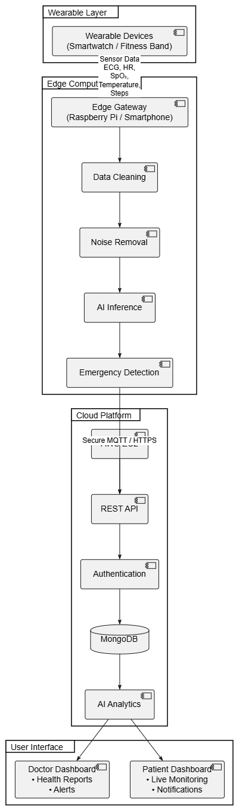

# Cloud-Based Wearable Health Analytics Platform using Edge-Cloud Intelligence


---

## Project Overview

The **Cloud-Based Wearable Health Analytics Platform using Edge-Cloud Intelligence** is an intelligent healthcare monitoring system that combines **Wearable IoT Devices**, **Edge Computing**, **Artificial Intelligence**, and **Cloud Computing** to provide real-time patient monitoring and predictive health analytics.

Modern wearable devices generate large volumes of physiological data such as heart rate, ECG, oxygen saturation (SpO₂), body temperature, sleep quality, and physical activity. Processing all of this information directly in the cloud increases communication latency, bandwidth usage, and response time during medical emergencies.

This project proposes an **Edge-Cloud Architecture** where wearable sensor data is first processed by nearby edge devices. The edge layer performs data cleaning, filtering, and preliminary AI inference before transmitting relevant information securely to the cloud. The cloud platform performs long-term storage, advanced analytics, visualization, and report generation for healthcare professionals and patients.

---

# Problem Statement

Traditional cloud-based healthcare monitoring systems rely entirely on cloud servers for processing physiological data generated by wearable devices. This architecture introduces several challenges including:

- High communication latency
- Increased bandwidth consumption
- Delayed emergency response
- Privacy concerns
- Limited real-time intelligence
- High cloud computation cost

To overcome these limitations, an intelligent healthcare monitoring platform that integrates **Edge Computing** with **Cloud Intelligence** is proposed.

---

# Objectives

The primary objectives of this project are:

- Monitor patient health continuously using wearable devices.
- Reduce latency through edge computing.
- Perform real-time anomaly detection.
- Minimize unnecessary cloud communication.
- Securely store patient records.
- Generate intelligent health reports.
- Enable remote healthcare monitoring.
- Improve emergency response time.
- Ensure scalability and reliability.

---

# Proposed Architecture

## System Architecture



### Architecture Flow

```
Wearable Devices
        │
        ▼
Edge Computing Layer
        │
 Secure MQTT / HTTPS
        ▼
Cloud Platform
     ┌──────────────┐
     ▼              ▼
Doctor Dashboard  Patient Dashboard
```

---

# System Components

## 1. Wearable Layer

The wearable layer consists of smart wearable devices capable of collecting physiological parameters.

### Data Collected

- Heart Rate
- ECG
- Blood Oxygen (SpO₂)
- Body Temperature
- Blood Pressure
- Physical Activity
- Sleep Monitoring

Examples:

- Smartwatch
- Fitness Band
- Medical Wearables

---

## 2. Edge Computing Layer

The edge layer performs immediate processing before transmitting data to the cloud.

Functions include:

- Data Cleaning
- Noise Removal
- Feature Extraction
- Data Compression
- AI Inference
- Emergency Detection

Benefits:

- Reduced latency
- Lower bandwidth usage
- Faster response
- Improved privacy

---

## 3. Cloud Layer

The cloud platform performs advanced healthcare analytics.

Responsibilities include:

- REST API Services
- Authentication
- Cloud Storage
- Machine Learning Analytics
- Historical Data Analysis
- Report Generation

---

## 4. User Layer

### Doctor Dashboard

Features

- Live Patient Monitoring
- Health Reports
- Medical History
- Emergency Alerts
- Analytics Dashboard

### Patient Dashboard

Features

- Health Statistics
- Notifications
- Daily Reports
- Activity Tracking
- Personalized Recommendations

---

# Technology Stack

## Frontend

- React.js
- HTML5
- CSS3
- JavaScript

---

## Backend

- FastAPI
- Python

---

## Database

- MongoDB

---

## Artificial Intelligence

- TensorFlow
- Scikit-learn

---

## Cloud Platform

- Amazon Web Services (AWS)

Services Proposed

- EC2
- S3
- API Gateway
- IAM
- CloudWatch

---

## Edge Computing

- Raspberry Pi
- MQTT
- HTTPS

---

# Proposed Workflow

1. Wearable devices collect physiological data.
2. Data is transmitted to the edge gateway.
3. Edge device performs preprocessing.
4. AI detects abnormal health conditions.
5. Important information is transmitted securely.
6. Cloud stores patient records.
7. Analytics engine generates insights.
8. Dashboards display real-time information.
9. Emergency alerts are generated when required.

---

# Expected Features

- Real-time Health Monitoring
- Intelligent Disease Detection
- Cloud Data Storage
- Edge AI Processing
- Remote Patient Monitoring
- Secure Authentication
- Dashboard Visualization
- Notification System
- Historical Health Analytics

---

# Proposed Dataset

The following datasets may be used during implementation.

- PhysioNet
- MIMIC-IV
- UCI Human Activity Recognition Dataset
- Kaggle Wearable Health Dataset

---

# Repository Structure

```text
Cloud-Based-Wearable-Health-Analytics/
│
├── README.md
├── LICENSE
│
├── AI_Models/
│   └── README.md
│
├── Architecture/
│   ├── Architecture_Diagram.png
│   └── Architecture_Explanation.md
│
├── Backend/
│   └── README.md
│
├── Cloud/
│   └── README.md
│
├── Database/
│   └── README.md
│
├── Dataset/
│   └── Dataset_Details.md
│
├── Documentation/
│   ├── Literature_Survey.md
│   ├── Objectives.md
│   ├── Problem_Statement.md
│   ├── Research_Gap.md
│   └── Scope.md
│
├── Edge_Computing/
│   └── README.md
│
├── Frontend/
│   └── README.md
│
├── Presentation/
│   └── README.md
│
├── References/
│   └── References.md
│
├── Results/
│   └── README.md
│
└── Work_Distribution/
    └── Team_Roles.md
```

---

# Work Distribution

| Team Member | Responsibility |
|--------------|----------------|
| Syed Monis Raza (23BIT0228) | Project Management, Backend APIs, System Integration |
| Krish Agarwal(23BIT0427) | Frontend Development, Dashboard Design |
| Rudra Shrivatsav(23BIT0174) | AI Models, Edge Computing, Literature Survey |


---

# Expected Outcomes

- Efficient healthcare monitoring system.
- Faster emergency response.
- Reduced cloud latency.
- Lower bandwidth consumption.
- Improved patient safety.
- Secure healthcare data management.
- AI-assisted disease prediction.

---

# Future Scope

Future enhancements include:

- Deep Learning-based Disease Prediction
- Federated Learning
- Blockchain-based Medical Records
- Integration with Smart Hospitals
- Telemedicine Support
- Digital Twin Healthcare
- Personalized AI Healthcare Assistant

---

# References

1. IEEE Internet of Things Journal
2. IEEE Access
3. Sensors (MDPI)
4. Nature Digital Medicine
5. Journal of Medical Internet Research
6. IEEE Transactions on Cloud Computing
7. IEEE Transactions on Biomedical Engineering
8. Springer Healthcare Informatics
9. ACM Digital Library
10. Elsevier Future Generation Computer Systems

---

# Current Project Status

**Project Phase:** Planning & System Design

> **Note:** This repository currently contains project planning, architecture, literature survey, research gap analysis, documentation, and folder structure. Code implementation will be added in future development phases.